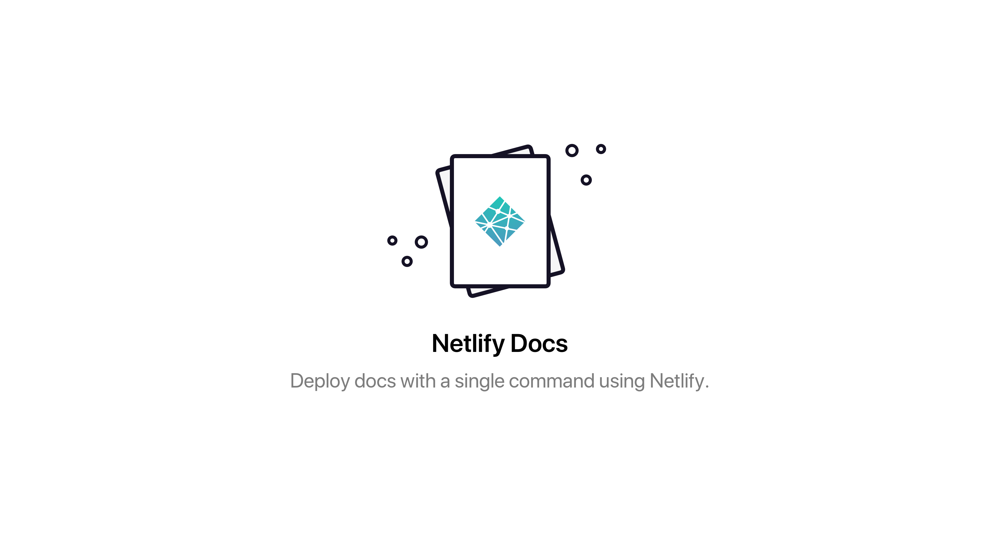
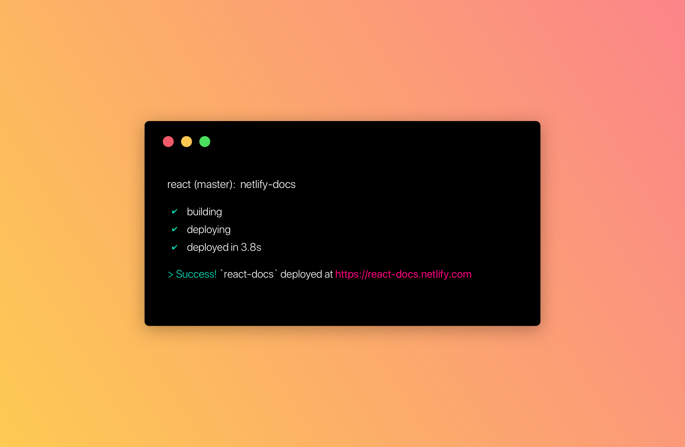

Deploy docs with a single command using [Netlify](netlify.com).

[](https://travis-ci.org/bukinoshita/netlify-docs)
[](https://github.com/sindresorhus/xo)
[](https://github.com/prettier/prettier)

## Install

```bash
$ npm install -g netlify-docs
```

## Usage

```bash
$ netlify-docs --help

  Usage:
    $ netlify-docs              Deploy `netlify-docs`

  Options:
    -h, --help                  Show help options
    -v, --version               Show version
```

_Make sure you have [netlify-cli](https://github.com/netlify/netlify-cli)
installed._



## Related

* [now-docs](https://github.com/bukinoshita/now-docs) —
  Deploy docs with a single command using now

## License

MIT © [Bu Kinoshita](https://bukinoshita.io)
